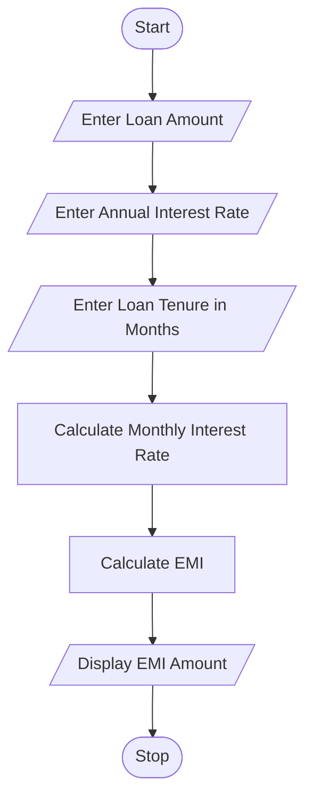

## Tutorial Task 22: Loan EMI Calculator

### 1. Problem Statement

Write a Python program to calculate the Equated Monthly Installment (EMI) for a loan using the loan amount, annual interest rate, and loan tenure.

---

### 2. Algorithm

1. Start the program.
2. Read the loan amount (Principal).
3. Read the annual interest rate.
4. Read the loan tenure in months.
5. Convert the annual interest rate into a monthly interest rate.
6. Calculate EMI using the EMI formula.
7. Display the EMI amount.
8. Stop the program.

---

### 3. Flowchart (README.md Code)


---

### 4. Python Source Code

```python
principal = float(input("Enter Loan Amount: "))
annual_rate = float(input("Enter Annual Interest Rate (%): "))
months = int(input("Enter Loan Tenure (Months): "))

monthly_rate = annual_rate / (12 * 100)

emi = (principal * monthly_rate * (1 + monthly_rate) ** months) / \
      ((1 + monthly_rate) ** months - 1)

print("Monthly EMI =", round(emi, 2))
```

---

### 5. Sample Input / Output

#### Input

```text
Enter Loan Amount: 500000
Enter Annual Interest Rate (%): 10
Enter Loan Tenure (Months): 60
```

#### Output

```text
Monthly EMI = 10623.52
```

---

### 6. Screenshots (README.md Code)

#### Source Code Screenshot

```md

```

#### Program Output Screenshot

```md

```

---

### Formula Used

The EMI is calculated using:

Where:

* **P** = Loan Amount (Principal)
* **R** = Monthly Interest Rate
* **N** = Number of Monthly Installments

-
