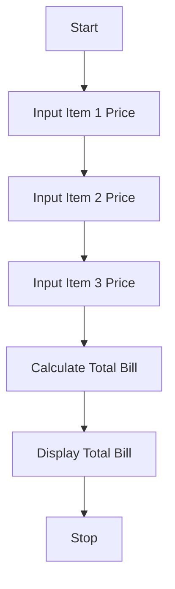

# Tutorial Task 24: Shopping Bill Generator

## 1. Problem Statement

Write a Python program to generate a shopping bill by accepting the prices of purchased items and calculating the total bill amount.

---

## 2. Algorithm

1. Start the program.
2. Read the prices of three items.
3. Calculate the total bill amount.
4. Display the total bill.
5. Stop the program.

---

## 3. Flowchart (README.md Code)


---

## 4. Python Source Code

```python
item1 = float(input("Enter price of Item 1: "))
item2 = float(input("Enter price of Item 2: "))
item3 = float(input("Enter price of Item 3: "))

total_bill = item1 + item2 + item3

print("Total Shopping Bill =", total_bill)
```

---

## 5. Sample Input / Output

### Input

```text
Enter price of Item 1: 250
Enter price of Item 2: 450
Enter price of Item 3: 300
```

### Output

```text
Total Shopping Bill = 1000.0
```

---

## 6. Screenshots (.md Code)

### Source Code Screenshot

```md

```

### Program Output Screenshot

```md

```

---

