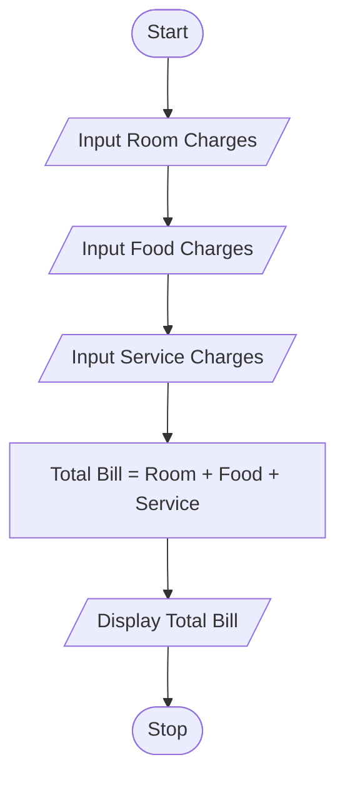

# Tutorial Task 25: Hotel Billing System

## 1. Problem Statement

Write a Python program to calculate the total hotel bill based on room charges, food charges, and other service charges.

---

## 2. Algorithm

1. Start the program.
2. Read room charges.
3. Read food charges.
4. Read service charges.
5. Calculate the total bill amount.
6. Display the total hotel bill.
7. Stop the program.

---

## 3. Flowchart (README.md Code)


---

## 4. Python Source Code

```python
room_charges = float(input("Enter Room Charges: "))
food_charges = float(input("Enter Food Charges: "))
service_charges = float(input("Enter Service Charges: "))

total_bill = room_charges + food_charges + service_charges

print("Total Hotel Bill =", total_bill)
```

---

## 5. Sample Input / Output

### Input

```text
Enter Room Charges: 2500
Enter Food Charges: 800
Enter Service Charges: 200
```

### Output

```text
Total Hotel Bill = 3500.0
```

---

## 6. Screenshots (.md Code)

### Source Code Screenshot

```md

```

### Program Output Screenshot

```md

```

---


