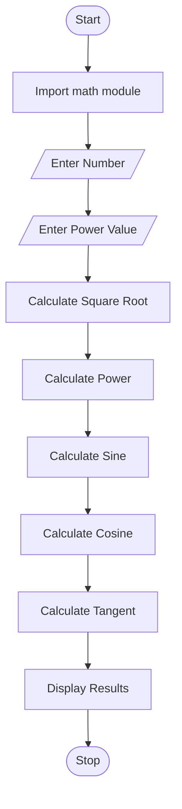

For **Tutorial Task 21: Scientific Calculator**, you can use the following **README.md** content in your GitHub repository.

# Tutorial Task 21: Scientific Calculator

## 1. Problem Statement

Write a Python program to perform scientific calculations such as Square Root, Power, Sine, Cosine, and Tangent of a given number using Python's built-in `math` module.

---

## 2. Algorithm

1. Start the program.
2. Import the `math` module.
3. Read a number from the user.
4. Read the power value from the user.
5. Calculate the square root of the number.
6. Calculate the power of the number.
7. Calculate the sine of the number.
8. Calculate the cosine of the number.
9. Calculate the tangent of the number.
10. Display all calculated values.
11. Stop the program.

---

## 3. Flowchart
## 3. Flowchart




## 4. Python Source Code

```python
import math

number = float(input("Enter a number: "))
power_value = float(input("Enter the power value: "))

print("Square Root =", math.sqrt(number))
print("Power =", math.pow(number, power_value))
print("Sine =", math.sin(math.radians(number)))
print("Cosine =", math.cos(math.radians(number)))
print("Tangent =", math.tan(math.radians(number)))
```

---

## 5. Sample Input / Output

### Input

```text
Enter a number: 30
Enter the power value: 2
```

### Output

```text
Square Root = 5.477225575051661
Power = 900.0
Sine = 0.49999999999999994
Cosine = 0.8660254037844387
Tangent = 0.5773502691896257
```

---

## 6. Screenshots

### Program Execution

```md

```

### Source Code Screenshot

```md

```

> Create a folder named `screenshots` in your repository and place the corresponding images inside it.

You can use the same template structure for all remaining tutorial tasks:
**Problem Statement → Algorithm → Flowchart → Source Code → Sample I/O → Screenshots**.
